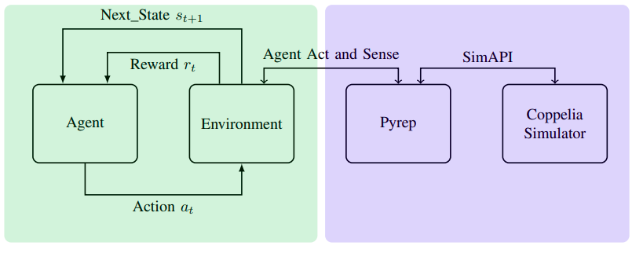
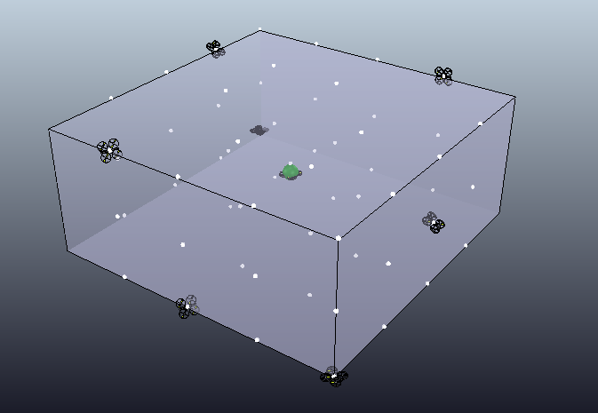

# Using Soft Actor-Critic for Low-Level UAV Control

This repository is the official implementation of [Using Soft Actor-Critic for Low-Level UAV Control](). 

<!-- >📋  Optional: include a graphic explaining your approach/main result, bibtex entry, link to demos, blog posts and tutorials -->

We train a policy using Soft Actor-Critic to control an UAV. This agent is dropped in the air, with a sampled distance and inclination from the target (the green sphere in the [0,0,0] position), and has to get as close as possible to the target. In our experiments the target always has the position = [0,0,0] and angular velocity = [0,0,0].

**Watch the video**


<!-- [](https://www.youtube.com/watch?v=9z8vGs0Ri5g) -->

<p align="center">
  <a href="https://www.youtube.com/watch?v=9z8vGs0Ri5g" title="Watch the Video">
    
  </a>
</p>


**Framework**
It is a traditional RL env that access the Pyrep plugin, which access Coppelia Simulator API. It is a lot faster than using the Remote API of Coppelia Simulator and you also have access to a simpler API for manipulating/creating objects inside your running simulation.

<!--  -->

<p align="center">
  
</p>

**Initial positions for the UAV agent**

<!--   -->

<p align="center">
  
</p>


## Requirements/Installing

### Docker

One of the safest way to emulate our envinronment is using a Docker container. Change the variables in the container and then run:

**create-image**

```creating-image
make create-image
```

**create-container**

```creating-container
make create-container
```
**training**

```training-an-agent
make training
```

**evaluate**

```evaluate
make evaluate
```

### Without-Docker

1) Install Coppelia
2) Install Pyrep
3) Install Drone_RL
4)To install requirements:

```setup
pip install -r requirements.txt
```

4) To install this repo:
```setup
python setup.py install
```


<!-- 
>📋  Describe how to set up the environment, e.g. pip/conda/docker commands, download datasets, etc... -->

## Training

To train the model(s) in the paper, run this command:

```train
./training.sh
```

>📋  Describe how to train the models, with example commands on how to train the models in your paper, including the full training procedure and appropriate hyperparameters.

## Evaluation

To evaluate my model with the optimal policy, run:

```eval
./evaluate.sh
```

<!-- >📋  Describe how to evaluate the trained models on benchmarks reported in the paper, give commands that produce the results (section below). -->

## Pre-trained Models

You can check the saved trained policies in:

- [saved_policies/](saved_policies/) 

<!-- >📋  Give a link to where/how the pretrained models can be downloaded and how they were trained (if applicable).  Alternatively you can have an additional column in your results table with a link to the models. -->


## Results

Run the notebooks on [notebooks/](notebooks/) to check the trajectories presented on the paper. 


## Credits

Code heavily based in [RL-Adventure-2](https://github.com/higgsfield/RL-Adventure-2)

Environment is a continuation of the work in:

    G.  Lopes,  M.  Ferreira,  A.  Sim ̃oes,  and  E.  Colombini,  “Intelligentcontrol of a quadrotor with proximal policy optimization reinforcementlearning,”Latin American Robotic Symposium, pp. 503–508, 11 2018

<!-- ### [Image Classification on ImageNet](https://paperswithcode.com/sota/image-classification-on-imagenet)

| Model name         | Top 1 Accuracy  | Top 5 Accuracy |
| ------------------ |---------------- | -------------- |
| My awesome model   |     85%         |      95%       |

>📋  Include a table of results from your paper, and link back to the leaderboard for clarity and context. If your main result is a figure, include that figure and link to the command or notebook to reproduce it. 
 -->

## License

[MIT-LICENSE](License.md)

## Cite us

