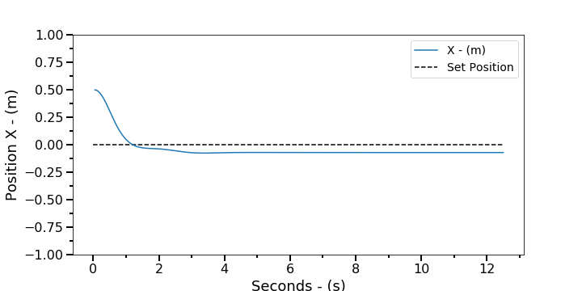
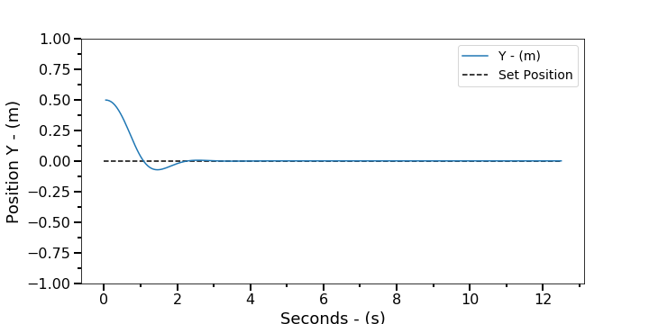
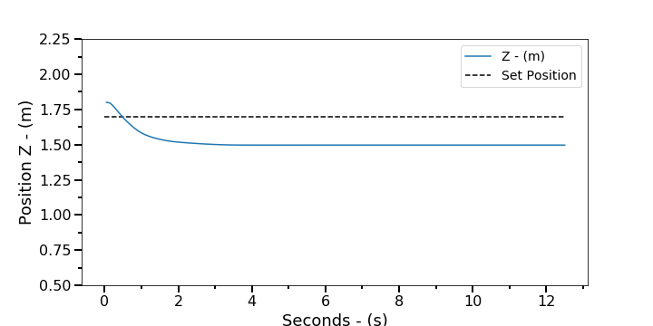
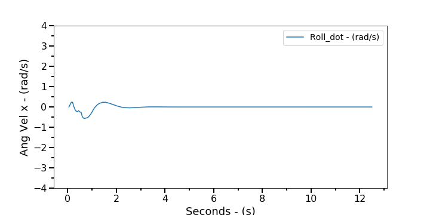
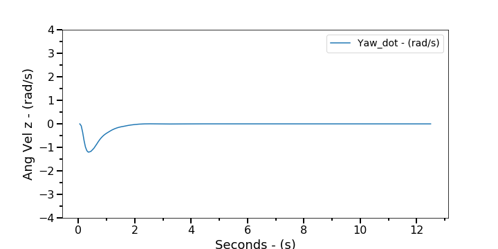
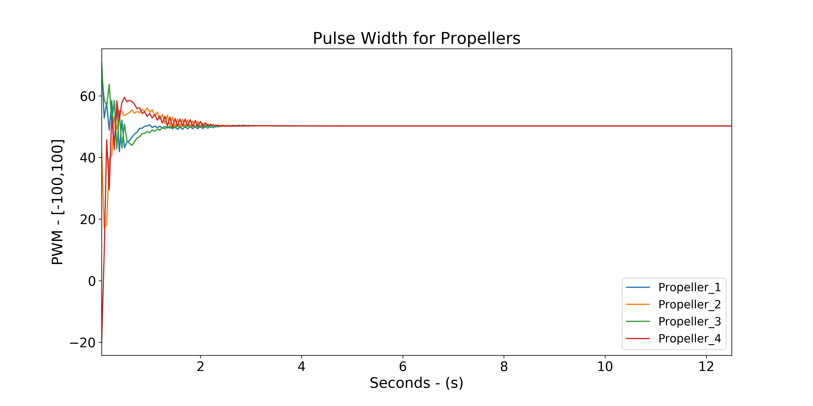

## Figures

**Initial positions for the UAV agent**

<!--   -->

### Pos x

  

### Pos y

  

### Pos z

  

### Ang x

  

### Ang y

  

### Ang z

  

### Networkd actions (Proppeler inputs)

  

